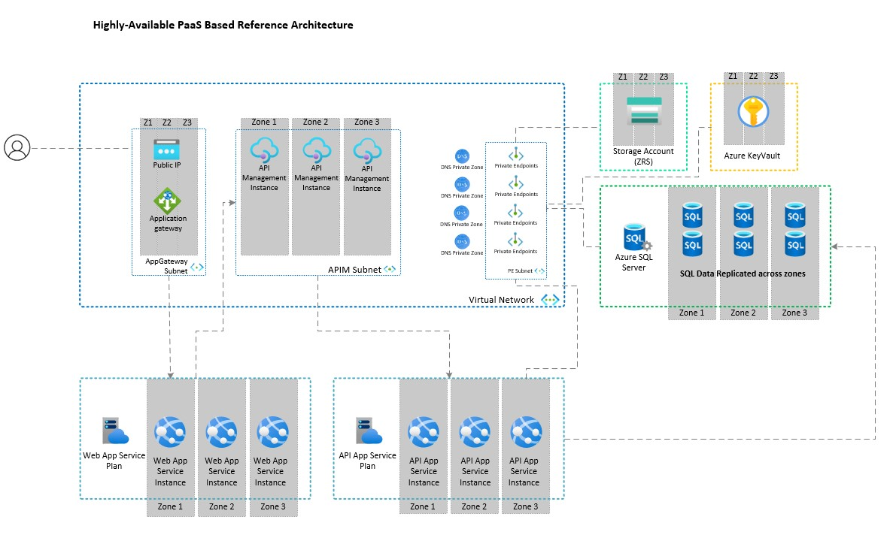

# AZ and Multi-Region Remediation Lab

### The content is in full development as of July 2024

This repo contains content for Hands-on Self paced Lab based on the following scenarios:

- The migration of Azure services that are deployed and not leveraging availability zones for resiliency
- Workloads that are deployed in a single region, with a desire to adopt a multi-region resiliency strategy.

The purpose of this lab is to provide a semi-guided experience for consumers to get hands-on with the migration of services to leverage AZ's or implement a multi-region workload pattern in an environment that is not related to any production workload, thus providing a safe space to conduct such activities in preparation for remediating resiliency issues for live workloads. 

This is achieved through deploying a synthetic workloads infrastructure in one of two archetypes (VM IaaS Based or fully PaaS based), then leveraging a mixture of the public Availabiltiy Zone Migration guidance and content developed exclusively for this lab within the Lab Guide Document. The same applies for the Multi-region scenario, leveraging the Lab Guide and a some of Microsofts Public docs.  

## The workloads

Please note - as of July 2024, this lab deploys just the infrastructure for the sythetic workload. There is no application deployment on top at this stage. We are focusing solely on Infrastructure remediation at this point, but will look to develop a basic application to deploy on top of this infrastructure to provide additional insights into the effects that Az migration / multi-region implementations steps has at the application level.

There are three lab scenarios to choose from:

1. Single Region IaaS Based Infrastructure Availability Zone Remediation
2. Single Region PaaS Based Infrastructure Availability Zone Remediation
3. Multi-region implementation using the PaaS based infrastructure design from scenario two.

### Scenario Two Reference Architecture

# Contribution

