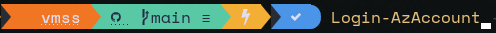
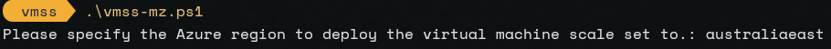
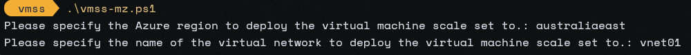
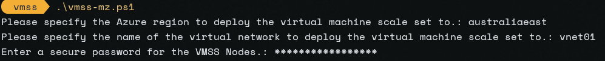
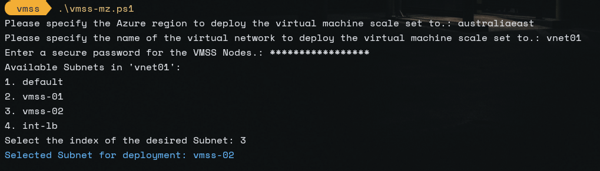

# WA-MZ-MR-Patterns (Pilot)


### The content is in full development as of 22/060/23. 

This repo contains Multi-Zone and Multi-Region Patterns for various Azure Architecture patterns. The following azure services / patterns for Multi Zone and Multi Region **brownfields** deployments will be as followed:

- Virtual Machine Scale Sets
- Azure Kubernetes Services
- Standalone Azure SQL
- Two Tier Application running on App Services and Azure SQL


## Prerequisites

Given that the artifacts within the repo are designed to address resiliency gaps for existing workloads, it assumes that certain resources are in place for a multi-zone or multi-region deployment to happen. Below is a breakdown of the core pre-reqs, followed by the resources that the deployment script has a dependency on.

**Core requirements**
- Azure subscription
- Contributor access over the subscription or RG scope you wish to deploy the solution into
- Access to connect to existing resources, specifically Virtual Networks subnets.

**Existing Resource Requirements**

- Single Region Multi Zone Deployment
    - Ensure you select an Azure Region that supports availability zones
    - Existing Virtual Network where both the VMSS and Load Balancer will reside
    - A subnet in the above VNET for targeting the deployment into

- Multi Region Multi Zone Deployment
    - Ensure you select two Azure Region that supports availability zones
    - Existing Virtual Networks in both regions where the VMSS and Load Balancer will reside
    - A subnet in the above VNET for targeting the deployment into

**Deployment Steps**

**Login to Azure** - Ensure you are in the correct context for deploying the chosen patterns resources into into.



**Check your context**

```text
    Get-AzContext
```
#### The following steps will vary between single region and multi region deployments. Just make sure the prerequisites are met and you should experience no issues.

**Run the deployment script** - Single Region VMSS for example. You will be prompted to provide the Azure region you wish to deploy into.


**Provide the name of the Virtual Network you wish to deploy into**


**Provide the password you wish to use for the VMSS**


**Select from the subnet list**  - You will be prompted with an Index of subnets available within your chosen Virtual network, select one to connect your LB and VMSS into
