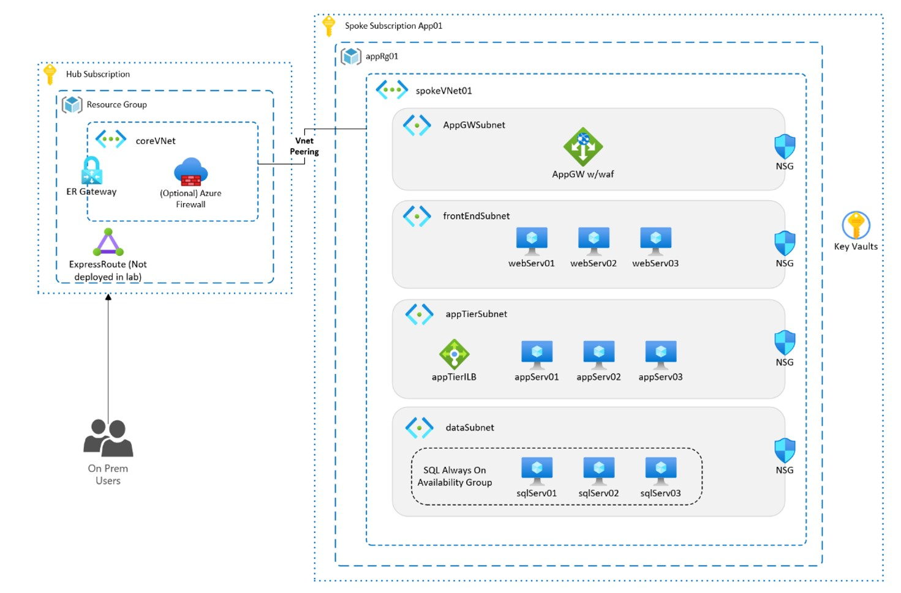
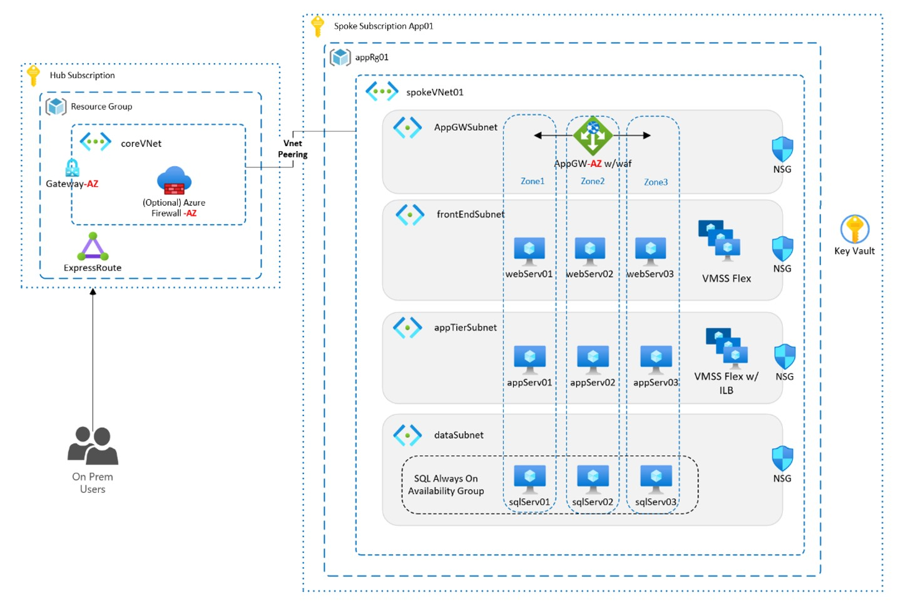
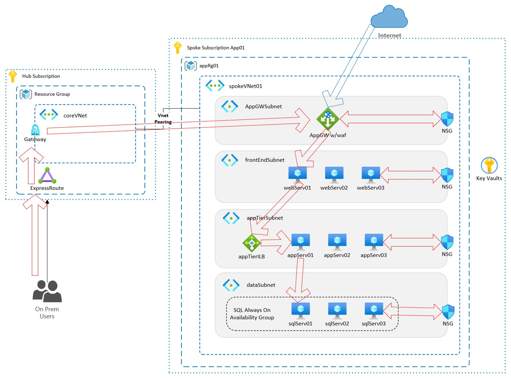

# Scenario 1 Guidance

In this scenario you will be working with an IaaS infrastructure architecture.

This application has been deployed into an Azure region based on the same IaaS architecture used on-premises, except for leveraging some first party Azure Services. The customer has experienced a few outages that have taken down all the VM instances in different tiers of the workload. They do not have a budget to deploy into a second region primarily due to licensing and compute costs. 

Given the workload's criticality, it has been decided that Availability Zones is critical to mitigating datacenter/zone failures moving forward. Used Azure services within this architecture include:
·	Virtual Network Gateway (ExR)
·	App Gateway w/WAF enabled
·	Virtual Machines
·	Internal Load Balancers
·	Key Vault
·	(Optional) Azure Firewall

Note: The diagram below shows the gateway and optional firewall in a Hub Subscription to better align with Landing Zones. For ease in the lab, everything is deployed into a single subscription and resource group. 

### Desired State Details
Shift all resources to being Availability Zone deployed. 

### Getting Started
To begin the lab, your first step is to deploy the synthetic workload. This will deploy the Azure Infrastructure shown in the architecture above into a single resource group called rg-waf-az-lab-scenario-1. Ensure you have the prerequisites above complete before following the steps below.

1.	Navigate to the following Github Repo and either download or clone it to your local device.
AZ-MultiRegion-Lab/labs at main · tsc-buddy/AZ-MultiRegion-Lab (github.com) 
2.	Open up the Github Repo Directory in VS Code and load up terminal, logging into Azure Powershell or Azure CLI.
3.	Ensure you are in the correct context for deploying resources.
4.	CD into the Labs\scenario-one directory
5.	Open the scenario-one.bicepparam file and update the parameters to your desired values.
6.	Run the following deployment command.
    1.	PS - New-azSubscriptionDeployment -Location <location> -TemplateFile .\labs\scenario-one\main.bicep -TemplateParameterFile .\scenario-one.bicepparam -verbose -name <PROVIDE DEPLOYMENT NAME>
    2.	AZ CLI - az deployment sub create --location <location> --template-file ./labs/scenario-one/main.bicep

 

### Expected Remediation Impact
The process will involve modifying the deployed resources to be either Zonal in the case of VMs, or Zone-Redundant for others. Care will need to be taken, as always, with SQL instances. There are a few options for doing this with Acme and conversation will be needed to determine the best options for this process. 
 

The services where we have portal/PowerShell/CLI based tools to help with this migration are:
- Azure VMs (convert to AZ pinned) (minimal downtime)
- VM Scale Sets (add AZ pinned VMs to scale set)
- ExpressRoute Gateway to AZ SKU (minimal downtime)
- Load Balancer (minimal downtime)
- (Optional) Azure Firewall

Services where there is not any tooling available to assist in migration are:

- App Gateway

### User / Dataflow Considerations
There are two different user flows in this environment, one from on-premises and one from the Internet. Internal users follow the on-premises path to the private IP address on the App Gateway. External users hit the public IP. Otherwise, the path is the same.
1. Inbound path (private or public)
    1. Private path 
        1. Users on-premises or on VPN traverse ExpressRoute to the gateway
        2. Gateway forwards traffic from hub to spoke using VNet Peering towards App Gateway
    2. Public path
        1. Direct inbound to public URL for App Gateway
        2. Either inbound path is valid and must be accounted for
2. NSG allowing web and control traffic to App Gateway 
3. App Gateway to NSG allowing web traffic to a web server 
4. Web Server to the NSG allowing application traffic to the load balancer 
5. Load balancer directing traffic to an app server
6. App Server to NSG allowing 1433 traffic to SQL tier
7. Always On Availability groups queries SQL and traffic hairpins back on the same path to the user. 
    - Internal users are authenticated through their Entra ID accounts using SSO. 
    - External users are authenticated through B2B accounts in Entra ID.
8. Always on Availability Groups replicate traffic to replica SQL VMs on a standardized schedule. 

Internal users are authenticated through their Entra ID accounts using SSO. 
External users are authenticated through B2B accounts in Entra ID.
Always on Availability Groups replicate traffic to replica SQL VMs on a standardized schedule. 

### Steps to remediation

Each VM will need to be converted to a Zonal VM and then placed into a VMSS Flex scale Set. This can be done at the portal level or through PowerShell/CLI. 

Do this for the Web and App servers but NOT for the SQL servers. Distribute the web servers across three zones and distribute the app servers across three zones. 

An important note here is that this migration process will create copies of existing VMs and place them into a new resource group. The original VMs will still exist in a Stopped (Deallocated) state in the original resource group. Those VMs should be deleted. 

When working with customers it is important to communicate that the resource group name will be different. If RBAC and/or Policy is defined at the resource group level, the customer will need to modify the new resource group to match the old. At the time of this writing, the new resource group name is automatically generated as the old resource group name with the region appended.
Part of this migration process involves creating a Move Collection. Using the Azure Portal, this also creates a new resource group.

[Tutorial - Move Azure single instance Virtual Machines from regional to zonal availability zones - Azure Virtual Machines | Microsoft Learn](https://learn.microsoft.com/en-us/azure/virtual-machines/move-virtual-machines-regional-zonal-portal)

[Move Azure single instance Virtual Machines from regional to zonal availability zones using PowerShell and CLI - Azure Virtual Machines | Microsoft Learn](https://learn.microsoft.com/en-us/azure/virtual-machines/move-virtual-machines-regional-zonal-powershell?tabs=PowerShell)

Once the VMs have been set up as Zonal instead of regional, we also recommend using VMSS in Flex orchestration. We will attach these new Zonal VMs to zone-redundant VMSS. Set up two VMSS using whatever process you would like, ensuring you set the orchestration mode to Flexible instead of Uniform. Set the number of instances to 1. The VMSS process will create at least one VM as part of the deployment process. 

Include the word “web” in the name of one and “app” in the name of the other. Ensure that both scale sets are configured to use 3 zones. 

**Follow the guidance here:**
[Attach or detach a virtual machine to or from a Virtual Machine Scale Set - Azure Virtual Machine Scale Sets | Microsoft Learn](https://learn.microsoft.com/en-us/azure/virtual-machine-scale-sets/virtual-machine-scale-sets-attach-detach-vm?tabs=portal-1%2Cportal-2%2Cportal-3)

>
>Note - As this is currently a Preview feature (as of time of writing this lab content) one of the key steps in this process is to register the feature in your subscription. The registration process can take anywhere from 10-15 minutes to complete. This was added as a prerequisite for this lab. If you have already completed this, you do not need to repeat the process. The information on the registration process is contained in the guidance link listed above this paragraph. 

- Add the three Web servers to one VMSS, and and the App servers to the other VMSS. 
- From a database perspective there are options. Migrating a SQL server to a Zone, if part of an Always On Availability Group (AOAG), will break that node in the group. Even though the migrated VM will have the same name and the same local configuration, it has a new NIC and a new IP Address. 
- You can migrate the VM, remove the old instance and add the new zonal instance inside of the AOAG. You could also just create a whole new SQL VM that is zonal and add it to the AOAG. 
- Since our SQL servers in the lab environment are technically not running SQL or deployed in an AOAG, you can just migrate them as you would a normal VM. Understand that in a customer scenario, you will want to work directly with the customer’s DBAs and Architects to understand how they want to handle this process.  
- Always On Availability Groups will handle the replication of data between the servers so there is no need at this point to also move the storage to ZRS.

### Composite Availability Estimate
Availability Calculations are intended to be used as a rough-order-of-magnitude (ROM) estimate for the general availability of a workload based on the design and dependency chain of each critical flow. It is a great way to understand how design decisions relating to both the infrastructure in Azure and your application code play a role is a workloads level of potential availability.

> **Call to Action:** Using the Microsoft Composite Availability Estimate Calculator (CATE), work out the Max Minutes of Downtime/month and the Composite Availability Target for the architecture and its critical flows to compare the before and after based on the changes you have made. For a table of details about the critical flows, read the [workload preface](../../docs/workloadPreface.md).

### Final Thoughts
The focus of this lab is to give the user hands on experience in the remediation processes for an IaaS based workload that is being placed into availability zones to add some very needed resilience. Future iterations of this lab will have an active application installed and running and will allow for an even more real-world scenario.

### Cleanup
Because the Convert VM process creates a new Resource Group this requires you to remove both resource groups. There will also be a resource group created for the Move Group. There will also be a deleted Key Vault that would need to be purged if you wanted to re-run the lab again at some point. 
